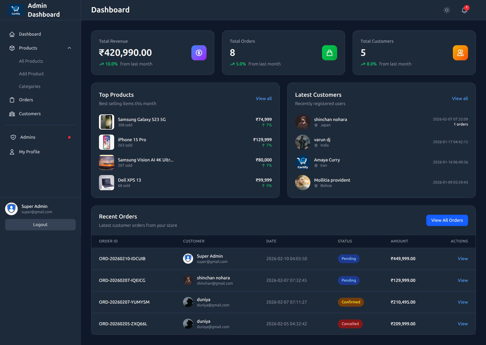
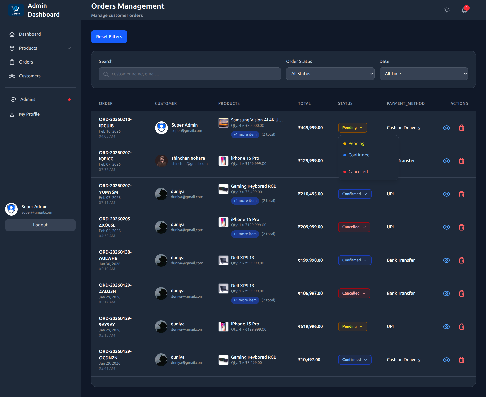
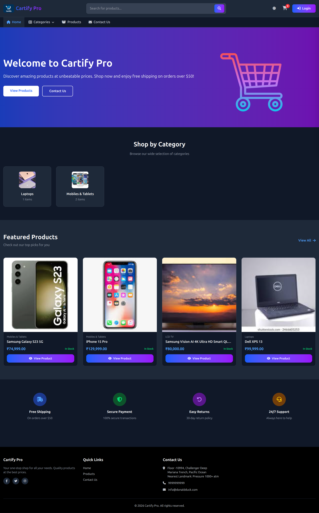
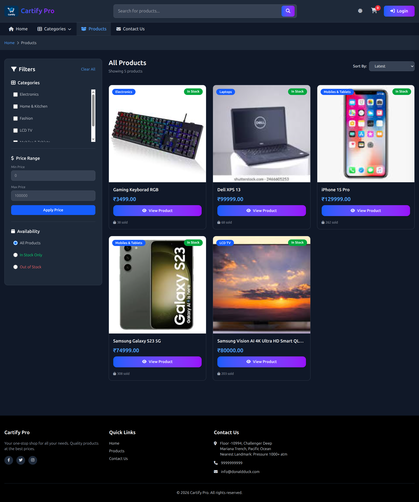
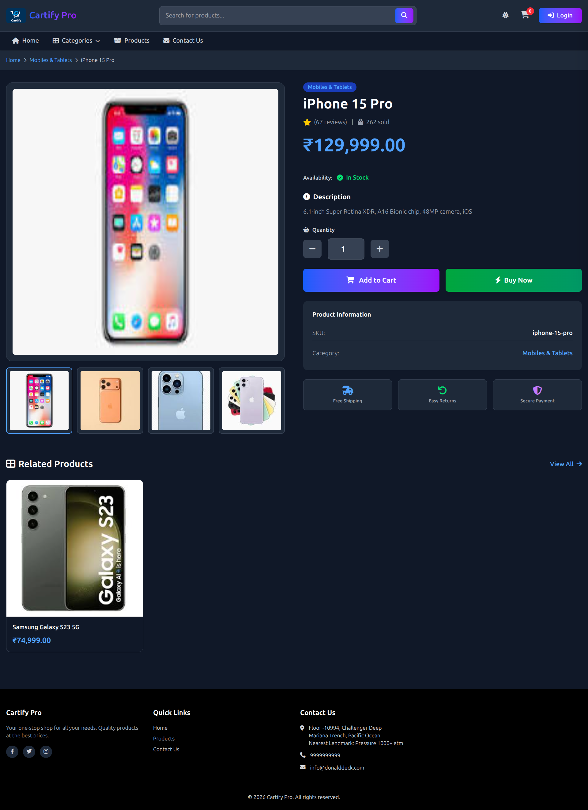
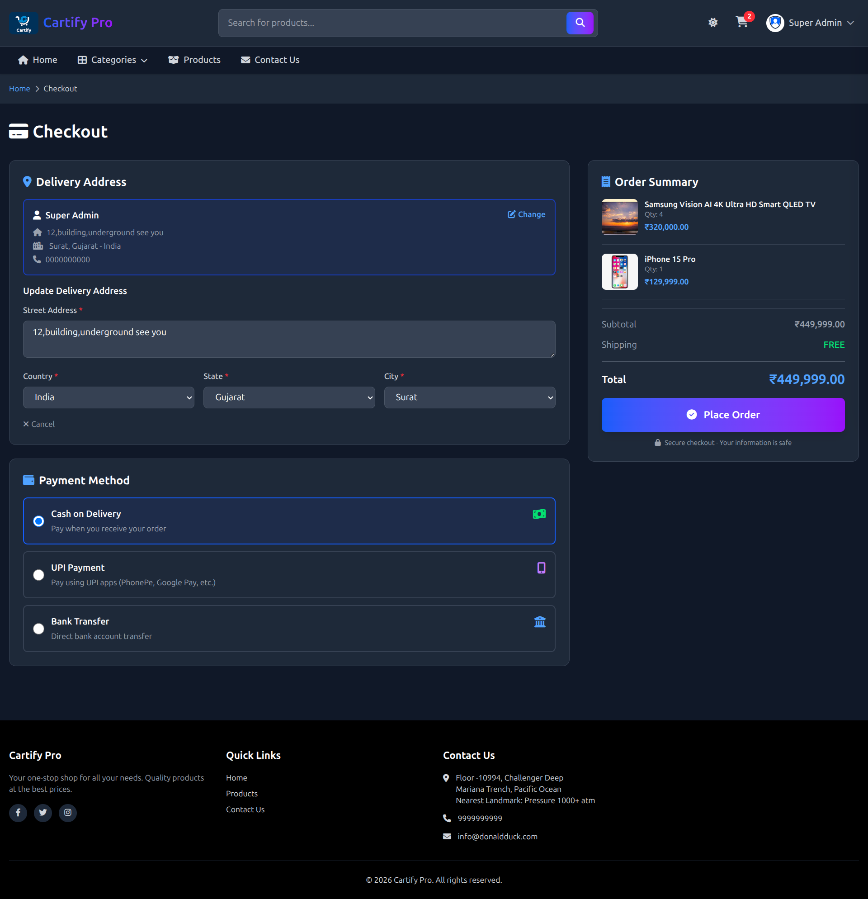
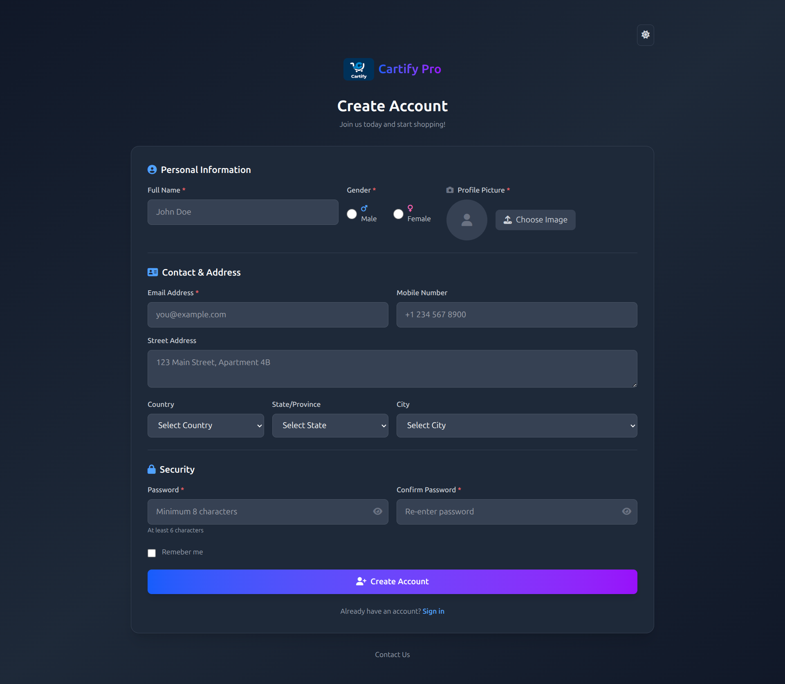

# 🛒 Cartify Pro - Laravel E-commerce Platform


A modern, full-featured e-commerce platform built with Laravel 12, featuring a Livewire-powered admin dashboard and AJAX-driven frontend.

---

## 📸 Screenshots

### Admin Dashboard

*Livewire-powered admin panel with real-time updates*

### Super Admin Panel

*Advanced admin controls and Super Admin Revork Admin sessions*

### Admin Orders Management

*Admin Mange Orders*

### User Frontend

*Modern, responsive user interface*

### Product Catalog

*Advanced filtering and search functionality*

### Product View

*Full Detail Product View*

### Checkout Process

*Streamlined checkout experience*

### User Register

*Detailed User Register Page*

---

## ✨ Features

### 🎯 Core Features
- ✅ Multi-role Authentication (Super Admin, Admin, User)
- ✅ Product Management (CRUD with images)
- ✅ Category Management (Multi-level categories)
- ✅ Shopping Cart (AJAX-powered)
- ✅ Order Management System
- ✅ User Profile Management
- ✅ Address Management with Cascading Dropdowns
- ✅ Search & Filter Products
- ✅ Dark Mode Support

### 👨‍💼 Admin Features (Livewire)
- ✅ Real-time Dashboard Statistics
- ✅ Super Admin Revork Other Admin sessions
- ✅ Product Management (Add/Edit/Delete)
- ✅ Category Management
- ✅ Order Management
- ✅ User Management
- ✅ Admin Profile Settings
- ✅ No Page Reload (Full Livewire)
- ✅ Image Upload with Preview
- ✅ Forgot Password with OTP
- ✅ Session Management

### 🛍️ User Features (AJAX)
- ✅ Product Browsing & Search
- ✅ Advanced Product Filters
- ✅ Autocomplete Search
- ✅ Add to Cart (AJAX)
- ✅ Buy Now (Direct Checkout)
- ✅ Cart Management
- ✅ Order History
- ✅ Order Cancellation
- ✅ Profile Management
- ✅ Address Management
- ✅ Password Reset with OTP
- ✅ Contact Us Page with Map

### 🔐 Authentication Features
- ✅ User Registration & Login
- ✅ Admin/Super Admin Login
- ✅ OTP-based Password Reset
- ✅ Session Management
- ✅ Remember Me Functionality

### 🌍 Address System
- ✅ Country → State → City Cascading
- ✅ Powered by [nnjeim/world](https://github.com/nnjeim/world)
- ✅ 2 API Routes for Dynamic Loading
- ✅ Real-time Location Updates

### 🎨 Design & UI
- ✅ Built with Tailwind CSS
- ✅ Dark Mode Toggle
- ✅ Smooth Animations
- ✅ Modern UI/UX
- ✅ Font Awesome Icons

---

## 🛠️ Tech Stack

### Backend
- **Framework:** Laravel 12.x
- **Real-time:** Livewire 3.x
- **Database:** MySQL
- **Authentication:** Laravel Sanctum/Breeze
- **Location Data:** nnjeim/world Package

### Frontend
- **CSS Framework:** Tailwind CSS 3.x
- **JavaScript:** Vanilla JS + jQuery (AJAX)
- **Icons:** Font Awesome 6.x
- **Build Tool:** Vite

### Admin Dashboard
- **Technology:** 100% Livewire
- **No Alpine.js** - Pure Livewire Components
- **Real-time Updates**
- **No Page Reload**

### User Frontend
- **Technology:** Laravel Controllers + AJAX
- **API Routes:** 2 Routes (State & City)
- **Dynamic Updates**
- **Smooth Interactions**

---

## 📦 Installation

### Prerequisites
- PHP 8.2 or higher
- Composer
- Node.js & NPM
- MySQL/MariaDB

### Steps

1. **Clone the repository**
```bash
git clone https://github.com/sahdev-parmar/cartify-pro
cd cartify-pro
```

2. **Install PHP dependencies**
```bash
composer install
```

3. **Install JavaScript dependencies**
```bash
npm install
```

4. **Environment setup**
```bash
cp .env.example .env
```

5. **Generate application key**
```bash
php artisan key:generate
```

6. **Configure database**
Edit `.env` file:
```env
DB_CONNECTION=mysql
DB_HOST=127.0.0.1
DB_PORT=3306
DB_DATABASE=cartify_pro
DB_USERNAME=root
DB_PASSWORD=
```

7. **Run migrations and seeders**
```bash
php artisan migrate
php artisan db:seed
```

8. **Create storage link**
```bash
php artisan storage:link
```

9. **Build assets**
```bash
npm run build
```

10. **Start development server**
```bash
php artisan serve
```

Visit: `http://localhost:8000`

---

## 🔑 Default Credentials

### Super Admin
```
Email: super@admin.com
Password: 123456
```

---

## 📂 Project Structure

```
cartify-pro/
├── app/
│   ├── Http/
│   │   ├── Controllers/          # User-facing controllers
│   │   ├── Livewire/
│   │   │   └── Admin/            # Admin Livewire components
│   │   └── Middleware/
│   └── Models/
├── database/
│   ├── migrations/
│   └── seeders/
├── resources/
│   ├── views/
│   │   ├── adminV1/                # Admin views (Livewire)
│   │   ├── Auth/                   # Frontend Auth
│   │   ├── cart/                   # Cart page
│   │   ├── category/               # Category page
│   │   ├── contactus/              # Contact-us page
│   │   ├── home/                   # Home page
│   │   ├── layout/                 # Frontend Layout
│   │   └── livewire/               # livewire
│   │   └── order/                  # Order page
│   │   └── product/                # Products page
│   │   └── profile/                # MY-profile page
│   ├── css/
│   └── js/
├── routes/
│   ├── web.php                   # User routes
│   └── admin.php                 # Admin routes
└── public/
    └── storage/                  # Uploaded files
```

---

## 🌐 API Routes

The project includes 2 API routes for dynamic location loading:

```php
// Get states by country
GET /api/states/{country_id}

// Get cities by state
GET /api/cities/{state_id}
```

**Usage Example:**
```javascript
// Load states when country changes
$.ajax({
    url: '/api/states/' + countryId,
    success: function(data) {
        // Populate state dropdown
    }
});
```

---

## 📦 Third-Party Packages

### Required Packages

1. **nnjeim/world** - Location data (Countries, States, Cities)
2. **livewire/livewire** - Admin dashboard components
3. **intervention/image** - Image processing

---

## 🎨 Frontend Architecture

### User Frontend
- **Controller-based** - Traditional Laravel controllers
- **AJAX-driven** - No page reloads
- **jQuery** - For AJAX requests
- **Tailwind CSS** - Styling

### Admin Dashboard
- **100% Livewire** - No Alpine.js
- **Component-based** - Reusable components
- **Real-time updates** - No page reload
- **Tailwind CSS** - Consistent styling

---

## 🚀 Key Features Breakdown

### 1. Shopping Cart
- AJAX Add to Cart - No page reload
- Cart Sidebar - Quick view
- Quantity Update - Real-time
- Remove Items - Instant update

### 2. Checkout System
- **Two Methods:**
  - Cart Checkout (Multiple items)
  - Buy Now (Single item, skip cart)
- Address Selection
- Payment Method Selection
- Order Confirmation

### 3. Product Filtering
- Category Filter - Multi-select
- Price Range - Min/Max
- Stock Status - In stock/Out of stock
- Sort Options - Price, Name, Latest
- Search - Autocomplete suggestions
- Active Filters - Removable chips
- AJAX Pagination

### 4. Order Management
- **Order Status:**
  - Pending (Can cancel)
  - Confirmed (Processing)
  - Cancelled (Final)
- Order History
- Order Details
- Cancellation (Pending only)

---

## 🔒 Security Features

- ✅ CSRF Protection
- ✅ SQL Injection Prevention
- ✅ XSS Protection
- ✅ Password Hashing (bcrypt)
- ✅ Secure Session Management
- ✅ File Upload Validation
- ✅ Rate Limiting
- ✅ OTP-based Password Reset

---

## 🌙 Dark Mode

Full dark mode support across:
- ✅ User Frontend
- ✅ Admin Dashboard
- ✅ Authentication Pages
- ✅ Profile Pages
- ✅ Cart & Checkout

---

## 🙏 Acknowledgments

- [Laravel](https://laravel.com) - The PHP Framework
- [Livewire](https://livewire.laravel.com) - Full-stack framework
- [Tailwind CSS](https://tailwindcss.com) - CSS Framework
- [nnjeim/world](https://github.com/nnjeim/world) - Location data package
- [Font Awesome](https://fontawesome.com) - Icon library

---

## 👨‍💻 Developer

**Your Name**
- GitHub: [@sahdev-parmar](https://github.com/sahdev-parmar)
- LinkedIn: [sahdev-paramr](https://linkedin.com/in/sahdev-parmar-023b92352)

<div align="center">

**⭐ Star this repo if you find it useful!**

Made with ❤️ using Laravel & Livewire

</div>